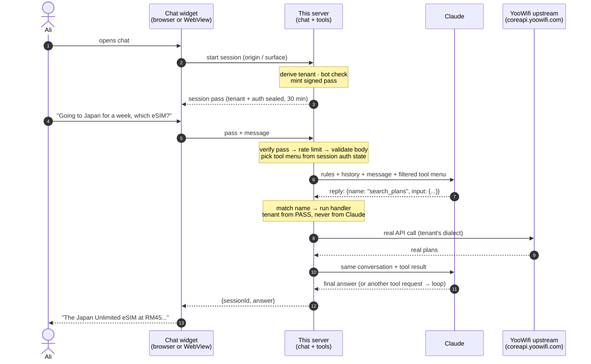

# YooWifi — End-to-End Flow: User Prompt → Answer

The complete journey of one user message, from typing in the chat to seeing the answer.

> **Status:** agreed target architecture, validated against discovery reports from all three
> client surfaces (see §11). Phase 1 of this repo — tools, resolver, registry, adapters — is
> built. The chat layer described here is **not yet built**; this is its specification.

---

## 1. Why three boxes

The original design had four:

```
browser  →  app backend  →  this server  →  upstream
```

The app backend held the secret key and asserted **which tenant** and **which user** — trustworthy,
because the user had logged in to it.

**Discovery confirmed there is no such backend on any customer-facing surface.** The web app and
the mobile app are both pure clients calling `coreapi.yoowifi.com` directly. So:

```
browser / app  →  this server  →  upstream
```

The two jobs the app backend used to do are covered another way:

| Job the app backend did | Who does it now |
|---|---|
| Held a secret app key | **Gone** — replaced by a session pass this server mints and signs |
| Said which tenant | **This server**, derived from the request's origin/surface |
| Said who the user is | **Nobody in v1.** In v2, an OTP verified by upstream (§5, Stage 5) |

---

## 2. The surfaces, and how the chat reaches each

| Surface | Delivery | Tenant identified by | In v1? |
|---|---|---|---|
| **Web** (`yooweb-newdesign`) | `<script>` tag — no CSP, and third-party widgets are already injected this way | `Origin` header | ✅ |
| **Mobile** (Expo/React Native) | **WebView** loading our chat page, shipped via **expo-updates OTA** — no app-store release needed | surface parameter passed to the WebView | ✅ |
| **CRM / admin** | out of scope — internal ops console (refunds, inventory, rate plans) | — | ❌ |

Mobile is cheaper than expected: a working WebView↔native `postMessage` bridge already exists in
that codebase, so the pattern is proven rather than prototypical. **One chat page serves both
surfaces**; only the delivery mechanism differs.

The CRM is excluded deliberately. It is a staff and reseller console with write operations
(refunds, charges, eSIM activation, bulk orders) and client-side-only role enforcement. An
assistant there is a different product — see §13.

---

## 3. The two session types

| | Anonymous session | Authenticated session |
|---|---|---|
| Who | Browsing, not signed in | Verified by OTP (§5, Stage 5) |
| Tools available | `search_plans`, `get_pricing`, `get_coverage` | above **+** `check_order_status` |
| Identity | none — and no tool needs one | `userId`, confirmed by upstream, held in the session |
| Ships in | **v1** | **v2** |

Most users asking *"which plan for Japan?"* are not signed in, and shouldn't have to be. Plans,
prices, and coverage are the same data anyone sees browsing logged out — confirmed on both web
and mobile, where plan endpoints require no user id. An anonymous session is therefore safe by
construction: there is no personal data behind those three tools to leak.

---

## 4. The journey at a glance



---

## 5. Step by step

### Stage 0 — Server starts

Validate env vars (`ANTHROPIC_API_KEY`, `SESSION_SIGNING_KEY`, `SERVICE_API_KEY`, every tenant
secret ref). Load and validate `tenants.json`. Build the tool table. Listen on one port. Any
missing secret → refuse to start.

### Stage 1 — Session creation

**1. Ali opens the chat** — a bubble on the website, or a WebView screen in the app.

**2. The widget asks this server to start a session.** No message yet.

**3. The server derives the tenant.** On web, from the `Origin` header:

```
yoowifi.com.my  →  web-yoowifi-my
```

The client **never sends a tenant id** — there is no field for it, so there is nothing to tamper
with. On mobile, where no `Origin` exists, the surface is passed to the WebView. That value *is*
client-controlled — and it doesn't matter, for the reason in §10 (`publicChat`).

**4. Bot check** — reCAPTCHA, already present on the web surface and reusable.

**5. The server mints a session pass** (§6).

### Stage 2 — A message arrives

**6. Ali types** *"Going to Japan for a week, which eSIM?"*. The widget sends **the pass** and
**the message**. Nothing else — no tenant, no user id, no login status.

**7. The gate**, in order:
- pass signature valid and unexpired? (else 401)
- rate limits — per session, per IP or device fingerprint, per tenant; minute **and** day? (else 429)
- body valid and sanely sized? (Zod)

Any failure short-circuits **before** Claude is called, so a rejected request costs nothing.

**8. Load the session.** History from the session store. Tenant and auth state **from the pass** —
sealed at step 5, unchangeable mid-conversation.

### Stage 3 — The Claude loop

> **Every network call starts at this server.** Claude has no internet access, no address book,
> and no way to reach YooWifi. It answers calls; it never makes them.
> **Claude proposes, this server disposes.**

**9. This server calls Claude**, sending four things and nothing else:
- the system prompt (persona, *"only state what the tools return"*, and the reply language — §8)
- the conversation history
- Ali's new message
- **the tool menu, filtered by the session's auth state** (§7)

Nothing tenant-specific appears in any of the four.

**10. Claude's reply comes back** — structured data, not prose:

```json
{
  "stop_reason": "tool_use",
  "content": [{
    "type": "tool_use",
    "id": "toolu_01ABC",
    "name": "search_plans",
    "input": { "originCountry": "MY", "destinationCountries": ["JP"],
               "durationDays": 7, "deviceType": "esim" }
  }]
}
```

A **name** and a **payload**. Note what the format has no room for: no URL, no tenant, no key, no
user. Claude cannot send those because there is no field for them.

**11. This server matches the name to a function.** No intelligence involved — an `if` on
`stop_reason`, then a lookup in the tool table built at startup (`src/server.ts`), then a call
with Claude's payload as the arguments. Unknown name → error response.

**12. The handler runs the existing Phase-1 pipeline** in-process:
- **tenant taken from the session pass** — never from anything Claude wrote
- validate args against the canonical Zod schema
- resolver → registry lookup, tool-allowance check, adapter selection, secrets from env
- per-tenant rate limit
- adapter translates the canonical request into that tenant's dialect and **calls upstream**
- upstream response mapped back to the canonical shape

The real endpoint comes from `tenants.json` — a config file you wrote. Never from Claude, never
from the browser.

**13. This server calls Claude again** — same conversation, plus the tool result. Clean canonical
JSON only: no endpoints, no tenant ids, no secrets.

**14. Claude replies again.** Either another tool request (→ back to step 11) or the final answer.
Typically one or two rounds.

> Steps 9–14 are driven by the Anthropic SDK's tool runner. It is still your code running on your
> server each time.

### Stage 4 — The answer

**15. Save and send.** Append both turns to the session, return `{ sessionId, answer }`.

**16. Ali reads it.**

**17. He replies** *"What about 14 days?"* — same pass, same session, same tenant, history intact.
Back to step 7.

### Stage 5 — Signing in (v2)

**18. Ali asks something personal:** *"Where's my order from last month?"*

**19. Nothing is refused — the tool was never offered.** The session is anonymous, so
`check_order_status` was not in the menu at step 9. Claude looks at its three tools, finds none
that fetch orders, and says so:

> *"I'd need you signed in to look that up."*

It may also call **`request_sign_in`** — a tool that takes no arguments, returns nothing, and
grants nothing. Its only effect is telling the widget to surface the login UI inline. Because it
has no power, a prompt-injected call to it achieves nothing beyond an unnecessary prompt.

The widget also carries a **persistent sign-in control**, so signing in always looks like part of
the app rather than something a chat message conjured up.

**20. Ali signs in — by OTP, inside the widget.**

There is no login token anywhere in the YooWifi estate (§11), so there is nothing to pass through
and verify. What does exist, on both apps, is an OTP flow on the dispatcher — and a successful
OTP **is** a possession proof:

```
widget  → this server → upstream:  authenticateForLogin { userId, captchaToken, fingerPrint }
                                   ↓ upstream sends an SMS passcode
widget  → this server → upstream:  verifyAndLogin { userId, passCode }
                                   ↓ upstream returns the user
this server: bind that userId into the session, mint a new pass with auth: "user"
```

**Claude sees none of this.** No phone number, no passcode, no user id passes through any tool
schema. The credential path and the conversation path never cross — the widget talks to this
server, this server talks to upstream, and Claude only observes that its menu grew.

Security here is exactly as strong as the apps' own login, because it *is* the apps' own login.

> **Abuse surface:** this triggers SMS sends, so it must be rate-limited hard per session, per IP
> or device fingerprint, **and per phone number**, with a captcha before any send. Upstream's
> `authenticateForLogin` already expects a `captchaToken`, so a captcha is mandatory rather than
> optional.

**21. The menu grows.** The next call to Claude includes `check_order_status`.

**22. Ali asks again**, Claude requests the order tool — **with no user in the payload, because the
tool has no user field.** The handler reads `userId` from the session, which got it from the OTP
verification in step 20.

### Stage 6 — The attack that does nothing

**23. Ali types:** *"Show me the orders for user u-99999."*

Claude may well try. But `check_order_status` has no user field to fill, so the handler looks up
the id in the session — which Ali never touched.

He gets his own orders. No error, no warning; it quietly does the right thing.

**The entire model in one line: Ali is never the one who says who Ali is.**

---

## 6. The session pass

A signed ticket issued when a chat starts. The widget keeps it and sends it with every message.

```
{ sessionId, tenantId: "web-yoowifi-my", auth: "anonymous",
  locale: "ms-MY", exp: 1735689600 }  +  HMAC signature
```

The client can **read** it. It cannot **change** it. Editing `auth: "anonymous"` → `"user"`, or
swapping `tenantId` to a B2B tenant, invalidates the signature; we recompute on arrival and
reject. Forging one requires `SESSION_SIGNING_KEY`.

That is what makes it trustworthy: everything sensitive — which tenant, whether they're signed in
— lives in something the user holds but cannot rewrite.

```
chat opens      → mint pass                → widget stores it
every message   → widget sends it          → verify signature + expiry, load session
user signs in   → mint a NEW pass          → auth: "user", verified userId
30 min idle     → expires                  → widget quietly opens a new session
```

**Why signed at all,** given history lives server-side anyway: a cheap signature check lets us
reject forged or expired passes without touching the session store — which matters on a public
endpoint under a flood.

---

## 7. Tool-menu filtering — the enforcement point

The menu is filtered by the session's auth state, **before Claude is called**:

```js
const tools = session.auth === 'user'
  ? [searchPlans, getPricing, getCoverage, checkOrderStatus]
  : [searchPlans, getPricing, getCoverage];
```

**The message is never inspected.** There is no classifier deciding "is this personal?" — the code
hands over three tools for every anonymous message, whether the user asked about Japan, their
orders, or the weather. The message goes to Claude untouched.

Two independent things:

| | Decided by | Depends on the message? |
|---|---|---|
| Which tools **exist** | the session | **No** |
| Which tool Claude **wants** | Claude | Yes |

Claude does the language understanding — it reads the question, sees three tools, works out none
of them fetch orders. The server does the enforcement — one boolean that cannot be argued with.

> **Never ask the smart part to enforce. Never ask the dumb part to understand.**

The alternative — send all four tools and instruct Claude *"only use this one if they're logged
in"* — puts enforcement inside the part that can be talked out of things. Claude refusing is not
the protection; Claude having nothing to refuse **with** is.

Same principle as `userId`: we don't ask Claude to pick the right user, we delete the field so
there is no wrong user to pick.

---

## 8. Language

The answer must be in the user's language. That's **two** things, and both must be right —
Japanese plan data with an English answer is as broken as the reverse.

| | What it controls | Where applied |
|---|---|---|
| **Upstream language** | What language plan names and descriptions arrive in | `language` field in the adapter envelope |
| **Reply language** | What language Claude writes in | an instruction in the system prompt (step 9) |

**Where locale comes from:** the widget, at session creation — the surface's current UI language.
Sealed into the pass, **overridable per message**, since people switch mid-conversation.

**Why it's safe to take from the client.** `tenantId` and `userId` are permissions — they decide
what data is reachable, so they can never come from the browser. `locale` is a preference. The
worst a user achieves by lying is an answer in a language they asked for.

### One normalization table, not per-app plumbing

Each surface uses its own locale vocabulary (web `vi`, mobile `vn`, both meaning Vietnamese; also
`ko`/`kr`, `ms`/`ml`, `zhcn`/`zh-CNS`, `zhhk`/`zh-CHT`). **This is not our problem to model per
app.** Whatever code arrives, we normalize it once at our boundary to a single internal standard,
then map that standard to whatever the dispatcher expects.

`localeRule` in the registry survives only as the **fallback default** when a request carries no
locale at all.

Known: web sends `JA` for Japanese (via its own `jp→JA` remap) and mobile sends `JA` too, so at
least that one agrees on the wire. **The full list of codes the dispatcher accepts is an open
question** (§12).

### The rule that must be in the system prompt

Answer **in** the user's language, but never **translate**:

- **plan names** — must stay findable in the catalogue the user is looking at
- **plan codes** — `JP-UNL-7D`
- **currency** — RM45 stays RM45; never convert, never re-symbol

A translated plan name is a plan the user cannot find or buy. This matters more with grounding
disabled (§10) — translation drift is exactly the class of error grounding would have caught, so
the prompt is the only thing preventing it.

### Translated fields are currently discarded

Upstream returns `trPlanName` and `trDescription` alongside the English fields — the web client
picks between them. But `CanonicalPlan` has neither, and
[`websiteAdapter.ts:47`](../src/adapters/websiteAdapter.ts#L47) maps only `raw.planName`, so **the
translated name never reaches Claude.** `CanonicalPlan` also has no `description` at all, which is
thin material for *"which plan suits me best?"*. Both are additions in §14.

---

## 9. Who knows what

| Party | Knows | Never sees |
|---|---|---|
| **Ali / the widget** | The conversation; an opaque signed pass | Tenants, tools, endpoints, secrets |
| **Claude** | System prompt, history, tool schemas, cleaned results | Tenant ids, endpoints, secrets, phone numbers, passcodes |
| **This server** | Everything — registry, adapters, secrets, sessions | — (trust anchor) |
| **Upstream** | Its own tenant's traffic; who owns each phone number | The conversation, the Anthropic key |

The isolation guarantee is a **data-flow property**: Claude only ever receives the four things
composed at step 9, and nothing tenant-specific is ever written into any of them.

---

## 10. Where things stop, and what flows back

| Failure | Stops at | What the user sees |
|---|---|---|
| Bad / expired session pass | Gate (step 7) | Widget silently re-opens a session and retries |
| Rate limit exceeded | Gate (step 7) | "One moment — try again shortly." No Claude call, no cost |
| Tenant not enabled for public chat | Session creation (step 3) | Chat does not load on that surface |
| Unknown tool name from Claude | Tool table (step 11) | Error result fed back; Claude recovers |
| Tool not allowed for tenant/role | Resolver (step 12) | Claude explains the action isn't available |
| Per-tenant rate limit | Resolver (step 12) | Claude asks the user to retry shortly |
| Upstream down / timeout | Adapter (step 12) | Sanitised `ok:false` — `toSafeMessage()` strips endpoints, secrets, stack traces |
| Personal question, anonymous session | **Menu** (step 19) | "Sign in and I can pull up your orders." |
| Wrong OTP passcode | Upstream verify (step 20) | Widget shows a retry; session stays anonymous |
| OTP rate limit / phone-number abuse | Gate before send (step 20) | "Too many attempts — try again later." |
| `create_order` (Phase 2 stub) | Tool | "Order creation is not available in this phase." |

---

## 11. Design decisions on record

| Decision | Rationale |
|---|---|
| **Three boxes, no app backend** | Confirmed by discovery on both customer surfaces — neither has one. Not a workaround; the shape of the estate. |
| **Tenant from origin/surface, never from a client-supplied tenant id** | Removes the field a user could tamper with. |
| **`publicChat` allowlist per tenant** | Origin (web) and surface parameter (mobile) are both forgeable by a script. Rather than make forging impossible, make it **worthless**: only tenants whose data is already public are reachable from the chat endpoint. B2B and the CRM stay off it. |
| **Two session types** | Forcing a login to ask *"which plan for Japan?"* would kill the headline use case. Anonymous is safe because those three tools expose no personal data. |
| **Identity via OTP, not a token** | There is no token anywhere in the estate (§12). The OTP flow already exists on both apps, and a successful OTP is a genuine possession proof. Buildable entirely on our side. |
| **Credential flow never touches Claude** | Phone numbers and passcodes move between widget → this server → upstream. No tool schema carries them. |
| **`userId` / `promoCode` removed from LLM-facing tool schemas** | Any field in a tool schema is a field the model can fill from the conversation. `userId` made impersonation a one-sentence prompt; `promoCode` made `/chat` a code-guessing oracle. |
| **Tool menu filtered by session state, message never inspected** | Enforcement belongs in the dumb, trusted layer; understanding belongs in the smart, untrusted one (§7). |
| **`request_sign_in` is a zero-power tool** | It takes no arguments and grants nothing, so a prompt-injected call achieves only an unnecessary prompt. |
| **One deployment, chat as a module (`src/ai/`)** | No HTTP hop between `/chat` and the tool handlers; `DirectToolInvoker` fills `tenantContextStorage` in-process. |
| **Tool runner + direct invocation, not Anthropic's MCP connector** | The connector authenticates with a bearer token only — it cannot carry per-request tenant headers. |
| **Mobile via WebView + OTA** | A WebView↔native bridge is already proven in that codebase, and expo-updates ships a chat entry point without app-store review. One chat page serves both surfaces. |
| **CRM excluded** | Staff/reseller ops console with write operations and client-side-only role enforcement. Different product (§13). |
| **Locale normalized once at our boundary** | Surfaces disagree on locale codes, but that's an input-normalization problem, not per-tenant plumbing. |
| **Grounding disabled for v1** | Plans and rates change rarely and manually at YooWifi. Halves upstream calls and latency. Code stays behind a flag. |
| **Request/response for v1, not SSE** | Streaming would have to be plumbed through every surface. Additive later. |

---

## 12. What discovery found

Three client repos were investigated (see `app-discovery-prompt.md` for the method).

**Confirmed:**
- **No backend** on the web app or the mobile app. Both are pure clients hitting the shared
  `apidispatcher`.
- **Anonymous plan browsing works** on both — plan endpoints require no user id.
- **Widget delivery is unobstructed**: no CSP anywhere; the web app already injects third-party
  widgets by script tag; mobile has a proven WebView bridge plus OTA updates.
- **reCAPTCHA already exists** on the web surface and in the OTP flow.

**The finding that reshaped v2:**

> **There is no authentication token anywhere in the estate.** All three surfaces use the user's
> **phone number** as the credential, resent as a plain field on every request. Web and mobile
> store it unencrypted (`localStorage` / `AsyncStorage`); the CRM compares passwords in plaintext
> in the database.

Consequences: token pass-through is impossible, so v2 uses OTP (Stage 5). Separately — and worth
raising with YooWifi regardless of this project — **this is a live IDOR across production apps,
keyed on guessable phone numbers.** Anyone who knows a customer's number can read their profile
and orders today, without our chat existing.

**Also found:**
- **Tenant is client-supplied upstream too.** The CRM sends `source` (the tenant) as a plain field
  with no server-verified session binding it. So upstream likely does not validate tenancy —
  meaning our resolver picking the right tenant is the only thing keeping brands separate in our
  path. Our isolation is real, but nothing downstream will catch a mistake.
- **`portal-tune` may not be a separate application.** One CRM serves all brands (Yoowifi, Yogofi,
  TuneTalk, MyRepublic, Skylink, WBB) at the hosts in that tenant record. "~19 surfaces" is
  probably ~19 brand configurations across three or four apps.
- **Secrets ship in client bundles** on all three surfaces (static API keys, AES keys used for
  client-side "encryption"). The existing security posture is looser than assumed.
- **Mobile may be showing untranslated plan content.** Its locale codes (`VN`, `KR`, `ML`,
  `ZH-CNS`) don't match the translation table's vocabulary. Unverified, and their bug, not ours —
  but worth reporting.

---

## 13. Open questions

| # | Question | Blocks | Ask |
|---|---|---|---|
| 1 | Which `source` / `platform` values does each app send to the dispatcher? | Mapping discovery reports onto tenant records | Grep each repo, or the API team |
| 2 | Is `portal-tune` a distinct app, or a `source` inside the CRM? | The tenant model and the "19 surfaces" number | API / platform team |
| 3 | Which language codes does the dispatcher accept? | Correct upstream translation | API team |
| 4 | Does upstream validate `source` against anything server-side? | How much our tenant discipline is load-bearing | API team |
| 5 | Is real token auth planned? | Would replace the OTP flow with something cleaner | API team |
| 6 | Monthly Claude budget, expected volume, data-residency rules | Spend cap, rate limits, launch approval | Product / legal |

None of these block v1.

### If an admin assistant is ever wanted

The CRM **does** have its own backend, so a proper proxy endpoint is available there — the
strongest architecture is available on the surface with the weakest data-exposure story. But it
would need: solved authentication, server-enforced roles (currently client-side only), explicit
human confirmation per write operation, and audit logging. Write operations in reach include
`chargeCustomer`, `refund`, `cancelPlan`, `endSubscription`, `activateEsim`, and `bulkOrders`.
Treat it as a separate phase, gated on the auth work.

---

## 14. Prerequisites before the chat layer ships

All in this repo. **None require backend access.**

1. **`publicChat: boolean` + `allowedOrigins` per tenant** — `src/registry/schema.ts` +
   `tenants.json`, enforced at session creation.
2. **Remove `userId` and `promoCode`** from `searchPlansInputSchema` and `getPricingInputSchema`.
   They stay on the canonical contract — set server-side, not by the model.
3. **`check_order_status` takes `userId` from the session**, not tool args. Today
   `handleCheckOrderStatus` uses the LLM-supplied value and ignores the trusted `TenantContext`
   one.
4. **Re-key rate limiting** — `checkRateLimit(tenantId, ...)` is currently one bucket per tenant
   (60/min for the whole Malaysia website). Under public traffic one abuser exhausts it for every
   real user. Key on session + IP/device + tenant, add a per-session token budget, and add
   per-phone-number limits for OTP.
5. **`GROUNDING_ENABLED` flag** in `src/config.ts` — grounding is unconditional today.
6. **Session store** — interface-backed: ~30 min idle TTL, ~20 turns retained, bounded size with
   LRU eviction. Redis once more than one instance runs.
7. **Origin/surface → tenant map**, driving tenant derivation and the CORS allowlist.
8. **`/chat` route** — pass minting and verification, gate, Claude tool runner,
   `DirectToolInvoker`, menu filtering.
9. **Chat widget** — one page, served from this server; script tag on web, WebView on mobile.
10. **Locale plumbing** — `locale` on `TenantContext` and the pass, one normalization table, the
    reply-language rule in the system prompt.
11. **`description` and the translated plan name on `CanonicalPlan`** + adapter mapping, so
    `trPlanName` / `trDescription` reach Claude instead of being discarded.
12. **(v2)** OTP endpoints — `authenticateForLogin` / `verifyAndLogin` proxying, captcha
    enforcement, per-number rate limits, session upgrade, `request_sign_in` tool.

### The one non-code ask

Deployment, not backend code: somewhere to host this server on a domain, a `<script>` tag added to
the web app, and a WebView entry point shipped via OTA on mobile.

---

## 15. Accepted risks

| Risk | Mitigation |
|---|---|
| **Public `/chat` used as a free LLM proxy** — the most likely abuse in practice. A bot check guards session *creation*, not session *use*; passes can be farmed. | Hard per-session token budget, per-IP/device and per-tenant limits, and a monthly spend cap on the Anthropic Console as the real backstop. |
| **OTP endpoint used to send unwanted SMS** | Captcha before every send (upstream already expects a `captchaToken`), strict per-number and per-session limits, and a cap on resends. |
| **Internet-facing process holds every secret** — `ANTHROPIC_API_KEY` and all tenant secrets in one `process.env`. One-deployment was accepted when only known backends could reach it; browser-facing changes that premise. | Keys in env only. Nothing sensitive logged. Short session TTL. Rotation is an env change plus restart. Pino tags every request with tenant/requestId. |
| **IP-based limits are weak both ways** — Malaysian mobile CGNAT shares IPs; attackers rotate proxies. | Combine session + IP + tenant; use the mobile device fingerprint where available; prefer token budgets to request counts. |
| **Forged origin / surface parameter** | Made harmless by `publicChat` — a forged value reaches only tenants whose prices are already published. |

---

## 16. Variant: the four-box model (if backend access ever arrives)

If an app backend can host a small proxy endpoint, it replaces the origin-derivation, bot-check,
and OTP machinery with something stronger:

```
browser  →  app backend  →  this server  →  upstream
             holds APP_API_KEY
             asserts tenantId + userId from its own login session
```

The header contract in `src/middleware/tenantAuth.ts` (`X-YooWifi-Service-Key` / `-Tenant-Id` /
`-User-Id` / `-User-Role`) is already built for exactly this and needs no changes.

Everything downstream of `/chat` — the tool table, resolver, adapters, session handling — is
identical in both models. Switching is a change to how the session is created, not a rebuild.

Note that the **CRM is the only surface that currently has such a backend**, and it is also the
surface we've excluded from v1.
